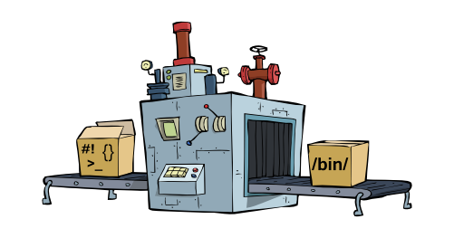

<h1 align="center">

</h1>

<h1 align="center">CREACMD</h1>

👨‍⚕️ 🔬 🚀

    
    
    

<strong>Creacmd allows you to convert your scripts into a command line.</strong>

🚀 Imagine being able to create a command line linked to one of your scripts, in a fraction of a second

😎 This is now possible with only three words in your terminal

🚀 Yes you read that right, in just three words ! 🚀

 

Compatible with Python, Javascript and Shell Bash (for the moment).

 

<h1>What’s In This Document</h1>

- <a href="#installation">Installation</a>
- <a href="#usage">Usage</a>
- <a href="#convert">creacmd</a>
- <a href="#del">delcmd</a>
- <a href="#contribute">How to Contribute</a>
- <a href="#license">License</a>
- <a href="#thanks">Thanks</a>

<h1 id="installation">👷 Installation</h1>

To install creacmd, run this command line in your terminal:

    npm install creacmd -g

<h1 id="usage">🎓  Usage</h1>

To start create a script in .js, .py or even .sh:

(For our example we create a hello.js file)

    function helloWorld() ({
        console.log("Hello World !");
    })();

<h1 id="convert">🔬 creacmd</h1>

Then... convert your script to a command line by running the command "creacmd", followed by the script to convert, followed by the command name you wish:

    creacmd hello.js hello

    🚀 Congratulations ! The hello command is now functional !

Test your new command line !

    hello

    Hello World !

🥳 🎈 Congratulations you have created your first command line with creacmd !

<h1 id="del">🗑️ delcmd</h1>

At any time you can delete a command line that you created with the "delcmd" command followed by the name of the command that you want to delete:

    delcmd hello

    🚀 The hello command, successfully deleted !

Now if you reissue the "hello" command in the terminal:

    hello

    command not found: hello

<h1 id="contribute">🤝 How to Contribute</h1>

Whether you want to help fix bugs, improve documentation or spread the word, it will be with great pleasure 💪 ❤️

Do not hesitate to take a look at the <a href="https://github.com/mrwaks/creacmd" target="_blank">github repository of creacmd</a>.

For any questions or suggestions do not hesitate to write to<a href="mailto: rudy.waks@gmail.com"> rudy.waks@gmail.com</a>.

<h1 id="license">📝 License</h1>

Licensed under <a href="https://github.com/mrwaks/creacmd/blob/main/license" target="_blank">the MIT License</a>.

<h1 id="thanks">❤️ Thanks</h1>

creacmd thanks you in advance for its use, and we hope to satisfy you !
